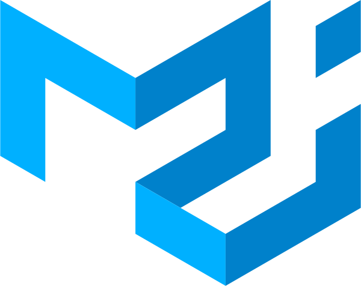

import StyledYouTube from '../../../src/components/StyledYouTube'

I completed a video series where I recorded the steps necessary to create a Random Quote Machine. The Random Quote Machine is created using [React](https://reactjs.org/), [Material UI](https://material-ui.com) and [Font Awesome](https://fontawesome.com) and deployed with [Netlify](http://netlify.com). [View the entire playlist.](https://www.youtube.com/playlist?list=PL3cz80ehFCan4srLIp1HmhrQ0CU8Cw9XM)

# Set Up Environment

In the first video, I set up the local environment, including the FreeCodeCamp test suite. I use [create-react-app](https://github.com/facebook/create-react-app) to bootstrap the application.

<StyledYouTube videoId='3QngsWA9IEE' />

# Begin Development

In the second video, I begin to develop the application. Specifically, I added a button with an event handler.

<StyledYouTube videoId='XnoTmO06OYo' />

# Fetch and Render a Quote

In the third video, I use the `fetch()` API to make a GET request and fetch quotes from a [JSON file](https://gist.githubusercontent.com/natebass/b0a548425a73bdf8ea5c618149fe1fce/raw/f4231cd5961f026264bb6bb3a6c41671b044f1f4/quotes.json). I introduce React lifecycle methods. A quote is rendered and displayed to the browser.

<StyledYouTube videoId='us51Jne67_I' />

# Choose a Random Quote on Button Click

In the fourth video, a new quote is rendered when our button is pressed.

<StyledYouTube videoId='iZx7hqHb5MU' />

# Add Styling with Help of Material-UI

In the fifth video, I use [Material-UI](https://material-ui.com) to style the Random Quote Machine.

<StyledYouTube videoId='zUefD1Ojr88' />

# Add Tweet Link to Application and Pass FreeCodeCamp Test Suite

In the sixth video, I use [Font Awesome](https://fontawesome.com) to render a Twitter icon. This icon allows the user to tweet a quote when clicked.

<StyledYouTube videoId='lpba9vBqXl0' />

# Deploy Random Quote Machine to Netlify

In the seventh and final video, I deploy the Random Quote Machine to [Netlify](https://www.netlify.com/).

<StyledYouTube videoId='Jvp8j6zrFHE' />

# Use React Hooks to Handle State
In the eighth and final video, I have some fun and add React hooks to handle the state of our application. Keep in mind that, as of November 6, 2018, this is not a stable API and is done just for fun and experimentation.

<StyledYouTube videoId='M_hFfrN8_PQ' />

I hope this helps in your coding journey. Please subscribe to the channel and comment / like the videos. Want me to cover something in a new video? Suggest it in a YouTube comment! Good luck!
