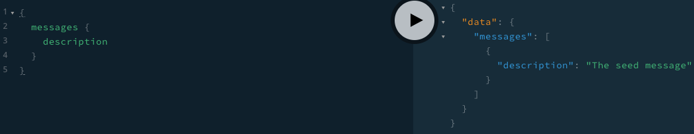
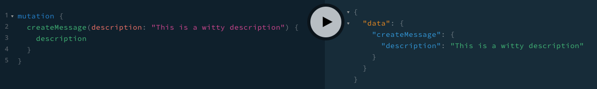

# Stand Up a Node.js Server with NestJS including TypeScript and GraphQL
Recently, I discovered NestJS and instantly fell in love. It is everything that I love about Angular (which includes TypeScript, the opinionated file structure, the modules, the decorators, and the dependency injection) in a Node framework. Additionally, it supports GraphQL.

## Before We Get Started
This tutorial is not meant for beginners. It will not cover Node basics. If you're looking to learn how Node and Express work, I made [a series of videos where I create and deploy a basic timestamp microservice](https://www.youtube.com/playlist?list=PL3cz80ehFCan4ph_96mDMCJuJ-bRMq9Yd). Additionally, it will not cover GraphQL basics.

This tutorial uses `nest-cli` version 6.6.4 as was written on September 18th, 2019. If anything is out of date or to report any errors/blockers, please feel free to [send me a tweet](https://twitter.com/AryanJabbari).

If, at any point you feel lost, you can take a look at [the final form of this code](https://github.com/AryanJ-NYC/nestjs-graphql-tutorial).

With all of that out of the way, let's do this!

## Getting Started with NestJS
NestJs is a Node.js framework that is compatible with both TypeScript and pure JavaScript. It comes with [guard](https://docs.nestjs.com/guards), [pipe](https://docs.nestjs.com/pipes) and [interceptor](https://docs.nestjs.com/interceptors) support out-of-the-box. This makes it easy-to-use yet extremely powerful.

To get started, install the NestJS CLI. This allows you to easily create a new NestJS project.
```bash
npm i -g @nestjs/cli
nest new my-node-project
```
where `my-node-project` is the name of your Node project. If you have NPM and yarn installed, the NestJS will ask for your preference. If the project was created correctly, you should have a newly created project with the following structure:

```bash
.
├── README.md
├── nest-cli.json
├── package.json
├── src
│   ├── app.controller.spec.ts
│   ├── app.controller.ts
│   ├── app.module.ts
│   ├── app.service.ts
│   └── main.ts
├── test
│   ├── app.e2e-spec.ts
│   └── jest-e2e.json
├── tsconfig.build.json
├── tsconfig.json
├── tslint.json
└── yarn.lock
```

Now go into that directory and run your newly created Node server:
```bash
cd my-node-project
npm run start:dev
```
 Go to [http://localhost:3000](http://localhost:3000) (by default) to hit your "Hello World!" endpoint.

## Sprinkle in GraphQL
[GraphQL](https://graphql.org/) is a query language for APIs. NestJS uses their own `GraphQLModule` (imported from `@nestj/graphql`) which is a wrapper around the [Apollo](https://www.apollographql.com/) GraphQL server.

Before we get started, let's remove the soon-to-be unused files (that were used for the "Hello World!" endpoint). More specifically, please delete `src/app.controller.ts`, `src/app.service.ts`, and their corresponding test files.

To get started with GraphQL and NestJS, install the necessary dependencies:

```
npm i --save @nestjs/graphql apollo-server-express graphql-tools graphql
```

With these packages installed, register the `GraphQLModule` in `/src/app.module.ts`:

```typescript
import { Module } from '@nestjs/common';
import { GraphQLModule } from '@nestjs/graphql';
import { join } from 'path';

@Module({
  imports: [
    GraphQLModule.forRoot({
      definitions: {
        path: join(process.cwd(), '/src/graphql.schema.d.ts'),
        outputAs: 'class',
      },
      typePaths: ['./**/*.graphql'],
      resolverValidationOptions: {
        requireResolversForResolveType: false,
      },
    }),
  ],
})
export class AppModule {}
```

I know, I know. There are tons of changes in here that I threw at you all. The [NestJS Graphql documentation](https://docs.nestjs.com/graphql/quick-start) does a fantastic job at explaining these changes. Here's my take.

### GraphQLModule.forRoot()
This registers the `GraphQLModule` with the server. The `.forRoot()` method takes an `options` object as an argument.

### definitions
The `@nestjs/graphql` package automatically generates TypeScript defintions from the GraphQL schemas (see `typePaths`). We use the `definitions` object to configure the `path` where TypeScript definitions should be saved. By default, the GraphQL types are transformed to interfaces. I personally prefer classes which is what is seen in `definitions.outputAs`.

### typePaths
`typePaths` tells the `GraphQLModule` where in the project to look for GraphQL files.

### resolverValidationOptions
When running the server without `resolverValidationOptions.requireResolversForResolveType` equal to false, I get a warning similar to [this one](https://github.com/apollographql/apollo-server/issues/1075). Therefore, it's false (for now).

Alright, back to GraphQL. Add `src/schema.graphql` to your project as follows:

```graphql
type Message {
  id: Int!
  description: String!
}

type Query {
  messages: [Message]!
}

type Mutation {
  createMessage(description: String!): Message!
}
```

Restart your Node server, go to [http://localhost:3000/graphql](http://localhost:3000/graphql) and you'll see a GraphQL playground. Of course, any query or mutation you try running will end in an error as we're yet to write our resolvers.

### Writing a GraphQL Resolver with NestJS
Let's write our first GraphQL resolver. Firstly, create a new NestJS module:

```bash
nest generate module messages
```

This will import the `MessagesModule` into `AppModule` and create a new `src/messages` directory where the business logic for your Messages resolver will live (see what I was saying about NestJS' modularity?).

Now, let's create that resolver. We'll create a dummy variable named `messagesThatReallyShouldBeInADb` that will function as our database and store all the messages and a GraphQL query that returns all the messages. In `src/messages/messages.resolver.ts`:

```typescript
import { Resolver, Query } from '@nestjs/graphql';

@Resolver()
export class MessagesResolver {
  // this is just for demonstration purposes
  // do NOT do this in real-life
  // this is meant as a substitute for a databse
  messagesThatReallyShouldBeInADb = [{ description: 'The seed message' }];

  @Query()
  messages() {
    return this.messagesThatReallyShouldBeInADb;
  }
}
```

Note the decorators NestJS provides us (`Resolver` and `Query`). This automagically maps to the `messages` query that we declared in `src/schema.graphql`. We must now provide this resolver to the `MessagesModule`. In `src/messages.module.ts`:

```typescript
import { Module } from '@nestjs/common';
import { MessagesResolver } from './messages.resolver';

@Module({
  providers: [MessagesResolver],
  exports: [MessagesResolver],
})
export class MessagesModule {}
```

Go to [http://localhost:3000/graphql](http://localhost:3000/graphql), refresh the pages, and run the messages query:

```graphql
{
  messages {
    description
  }
}
```

If everything was done correctly, you should see the seed message:


Now let's add the `createMessage` mutation to `src/messages/messages.resolver.ts`. Remember the [resolver type signature takes four arguments `(parent, args, context, info)`](https://www.apollographql.com/docs/apollo-server/data/data/#resolver-type-signature). NestJS provides decorators for each argument. For this specific mutation, we use the `@Args()` decorator and pass it the name of the argument we want to access (`description`):

```typescript
import { Mutation, Resolver, Query, Args } from '@nestjs/graphql';

@Resolver()
export class MessagesResolver {
  // this is just for demonstration purposes
  // do NOT do this in real-life
  // this is meant as a substitute for a databse
  messagesThatReallyShouldBeInADb = [{ description: 'The seed message' }];

  @Query()
  messages() {
    return this.messagesThatReallyShouldBeInADb;
  }

  @Mutation()
  createMessage(@Args('description') description: string) {
    const newMessage = { description };
    this.messagesThatReallyShouldBeInADb.push(newMessage);
    return newMessage;
  }
}
```

With the mutation added to the resolver, let's return to our GraphQL Playground at [http://localhost:3000/graphql](http://localhost:3000/graphql) and create some messages:

```
mutation {
  createMessage(description: "This is a witty description") {
    description
  }
}
```

which should successfully return:


Feel free to create a few messages using our new mutation and query for all messages.

## Conclusion
With that, you now have a NestJS server complete with GraphQL, a simple GraphQL schema and a simple resolver for that schema (complete with a query and mutation).

The next step is to add a database to this stack. Prisma is an amazing solution that provides us with additional GraphQL and database tooling. In the next installment of this series, we will dive into using Prisma to save our messages.

If you liked this post, please support me by following me on [Twitter](https://twitter.com/AryanJabbari), [YouTube](https://www.youtube.com/c/thewebdevcoach) and [GitHub](https://github.com/AryanJ-NYC).
