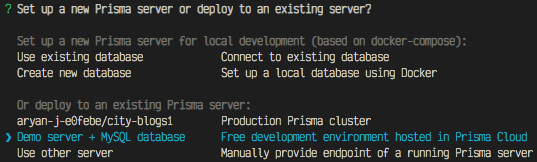
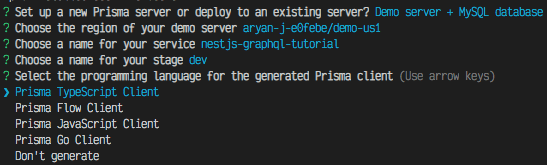
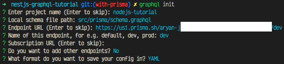

import StyledYouTube from '../../../src/components/StyledYouTube'

# Use Prisma with a NestJS GraphQL Server

## Before We Get Started

In my [last blog post](https://www.thewebdevcoach.com/stand-up-a-node-js-server-with-nestjs-including-typescript-and-graphql), I described how to stand up a Node.js server with NestJS and GraphQL. If you haven't yet, please read that blog post as this one will use the code created there and continue where that one left off.

This tutorial is not meant for beginners and will not cover Node, GraphQL or NestJS basics. If you're looking to get started with Node, take a look at my [Timestamp Microservice tutorial on YouTube](https://www.youtube.com/playlist?list=PL3cz80ehFCan4ph_96mDMCJuJ-bRMq9Yd).

I made [a video tutorial](https://www.youtube.com/watch?v=J1mTfisEYdw) based off of this blog post. I suggest reading this blog post and watching the video as they complement each other well.

<StyledYouTube videoId='J1mTfisEYdw' />

If at any point you get lost in this tutorial, please refer to [this tutorial's code on GitHub](https://github.com/AryanJ-NYC/nestjs-graphql-tutorial/tree/with-prisma). It should contain everything you need to catch up and integrate Prisma with NestJS.

If you want to see this code in action, please visit https://enigmatic-journey-72826.herokuapp.com/graphql.

Alright, let's crush some code.

## Where We Left Off
If you followed [my last tutorial](https://www.thewebdevcoach.com/stand-up-a-node-js-server-with-nestjs-including-typescript-and-graphql) correctly, you should end up with code that looks like [this GitHub branch](https://github.com/AryanJ-NYC/nestjs-graphql-tutorial/tree/nestjs-graphql). When you run `yarn start:dev`, a GraphQL server should spin up at [`http://localhost:3000/graphql`](http://localhost:3000). In the GraphQL playground, you should be able to make a `messages` query and a `createMessage` mutation. The server will look like [this one](https://enigmatic-journey-72826.herokuapp.com/graphql). If any of that is untrue, please refer to [the section above](#before-we-get-started).

## Let's Get Ready for Prisma
The first thing we need to do is instantiate a Prisma demo server and upload our data model to Prisma. For this, we'll use the [prisma-cli](https://github.com/prisma/prisma/tree/master/cli).

```bash
yarn global add prisma
# or
npm install -g prisma
```

With that installed, let's initialize our project and configure it to successfully use Prisma. From your project folder, run the following command:

```bash
prisma init
```

You'll be given a choice of Prisma servers:


For this tutorial, we will set up a Demo server + MySQL database.

The CLI will continue to ask configuration questions. Please be sure to choose `Don't generate` when asked for the programming language of the Prisma client:


We choose this since we will be generating the Prisma client later using `prisma-binding`.

## Defining Our Data Model and Deploying
After Prisma instantiation succeeds, two new files will be created at the root of our project:
* `prisma.yml` - a configuration file Prisma uses to generate their schema, define schema output paths, etc.
* `datamodel.prisma` - our project's data model which Prisma will use to generate schemas

`datamodel.prisma` is initialized with a basic `User` model. We will replace it with the `Message` model (be sure to add the new `@id` directive that Prisma supplies us with) from our `src/schema.graphql` file:

```graphql
# datamodel.prisma

type Message {
  id: Int! @id
  description: String!
}
```

Now that we edited the Prisma data model to make it our own, we are ready to deploy to Prisma and instantiate our database. To do this, run:

```bash
prisma deploy
```

This will deploy our changes to the database. If you change the data model in any way, `prisma deploy` needs to be re-run to ensure the database we are using and the Prisma schema and client stay up-to-date with our data model changes.

## Generate GraphQL Schema
The generated schema needs to be bound to GraphQL and we must create a Nest service from said schema. To do that, we need to generate API code and type annotations. Additionally, we will need to download the GraphQL schema (the schema we have now is in TypeScript) from our Prisma endpoint. The [`graphql-cli`](https://github.com/Urigo/graphql-cli) takes care of both these things.

```bash
yarn global add graphql-cli
# or
npm install -g graphql-cli
```

Now, let's initialize our project with a .graphqlconfig.yaml. In the Terminal, run:

```bash
graphql init
```

As with the previous CLI, the CLI will ask a number of configuration questions. For the purposes of this tutorial, please create a directory at `src/prisma` and use the local schema file path of `src/prisma/schema.graphql`. As for the endpoint URL, you should be able to copy and paste that from `prisma.yml`. If you ran through the CLI correctly, it should look like:


and a new file should be written at `/.graphqlconfig.yaml`. You should now be able to generate your GraphQL schema with:

```bash
graphql get-schema
```

Now that we've created a new (more complete) schema, we can delete the `src/schema.graphql` that we created in the [last tutorial](https://www.thewebdevcoach.com/stand-up-a-node-js-server-with-nestjs-including-typescript-and-graphql).

## Bind our GraphQL Server with Prisma
Prisma already has a GraphQL server running in front of the database they set up for us. We want to write our very own resolvers leveraging the Prisma GraphQL server and schema. To do this, we'll need to use [`prisma-binding`](https://github.com/prisma-labs/prisma-binding). This allows us to use the Prisma database service to more easily implement our own GraphQL resolvers.

First, let's install prisma-binding:

```bash
yarn add prisma-binding
# or
npm install -g prisma-binding
```

Now, we need to configure the GraphQL CLI to use `prisma-binding` to the TypeScript API and annotations we'll need to use in our code. Edit `.graphqlconfig.yaml` to look as follows:

```yml
# .graphqlconfig.yaml

projects:
  nodejs-tutorial:
    schemaPath: src/prisma/schema.graphql
    extensions:
      endpoints:
        dev: https://us1.prisma.sh/aryan-j/use-your-own-endpoint/dev
      codegen:
        - generator: prisma-binding
          language: typescript
          output:
            binding: src/prisma/prisma.binding.ts
```

Please note the `codegen` extension we added. We are all ready to generate our Prisma bindings!

```bash
graphql codegen
```

You'll see a new file at `/src/prisma/prisma.binding.ts` which contains the API that we will use to interact with our Prisma server.

## Create a Prisma Service
Now, we need a NestJS service that encapsulates the Prisma binding and will be responsible for interacting with our Prisma server. For this, we'll use the Nest CLI. In your Terminal, run:

```bash
nest generate module prisma
```

If you don't have the NestJS CLI installed, the instructions to do so are in [my last tutorial](https://www.thewebdevcoach.com/stand-up-a-node-js-server-with-nestjs-including-typescript-and-graphql).

If this was succesful, you should have a newly created `src/prisma/prisma.module.ts` file as well as a new line in `src/app.module.ts` that imports the `PrismaModule`.

Now, let's create our Prisma service:

```bash
nest generate service prisma
```

If this was successful, `src/prisma/prisma.service.ts` (and a corresponding test file) was created and added to your `PrismaModule`. Our `PrismaService` will simply be an instance of the Prisma binding that we generated at `src/prisma/prisma.binding.ts`. In `src/prisma.service.ts`:

```ts
// src/prisma/prisma.service.ts
import { Injectable } from '@nestjs/common';
import { Prisma } from './prisma.binding';

@Injectable()
export class PrismaService extends Prisma {
  constructor() {
    super({
      endpoint: 'https://us1.prisma.sh/aryan-j/use-your-own-endpoint/dev',
      debug: false,
    });
  }
}
```

## Use PrismaService to Manipulate Data in Prisma
The last thing we need to do is use our newly created `PrismaService` inside of our `MessagesResolver`. In NestJS, we need to be sure to export the service we want to share with other modules. With that service exported, any other module that imports that module will be able to use the exported service.

In our `PrismaModule` (`/src/prisma.module.ts`), let's export the `PrismaService`:

```ts
// src/prisma/prisma.module.ts
import { Module } from '@nestjs/common';
import { PrismaService } from './prisma.service';

@Module({
  providers: [PrismaService],
  exports: [PrismaService]
})
export class PrismaModule {}
```

and import the `PrismaModule` in our `MessagesModule`:
```ts
// src/messages/messages.module.ts
import { Module } from '@nestjs/common';
import { MessagesResolver } from './messages.resolver';
import { PrismaModule } from '../prisma/prisma.module';

@Module({
  imports: [PrismaModule],
  providers: [MessagesResolver],
  exports: [MessagesResolver],
})
export class MessagesModule {}
```

Lastly, in our `MessagesResolver`, we need to do a number of things:

1. Remove our `messagesThatReallyShouldBeInADb` array (we have a real database now, woo hoo! 🎉)
2. Inject `PrismaService` so that it can be used throughout the `MessagesResolver` instance.
3. Forward the `messages` query and the `createMessage` mutation to our Prisma server.

```ts
import { Mutation, Resolver, Query, Args } from '@nestjs/graphql';
import { PrismaService } from '../prisma/prisma.service';

@Resolver()
export class MessagesResolver {
  // the injected dependency is injected as an argument to the constructor
  constructor(private readonly prisma: PrismaService) {}

  @Query()
  messages(@Args() args) {
    return this.prisma.query.messages(args);
  }

  @Mutation()
  createMessage(@Args() args) {
    return this.prisma.mutation.createMessage(args);
  }
}
```

That's it! Your `MessagesResolver` is now using Prisma to resolve its queries and mutations. Let's test it!

## Testing Our New Resolvers
Open up [http://localhost:3000/graphql](http://localhost:3000/graphql). In the playground, we can use the following query and mutation:

```graphql
query allMessages {
  messages {
    id
    description
  }
}

mutation createMessage{
  createMessage(data: {description: "Hello"}) {
    id
    description
  }
}
```

## Conclusion
With this, you should be able to use Prisma with NestJS. Try extending the code to allow for message deletion and updates!

If at any point you got lost in this tutorial, please refer to [this tutorial's code on GitHub](https://github.com/AryanJ-NYC/nestjs-graphql-tutorial/tree/with-prisma). It should contain everything you need to catch up and integrate Prisma with NestJS.

If you want to see this code in action, please visit https://enigmatic-journey-72826.herokuapp.com/graphql.
