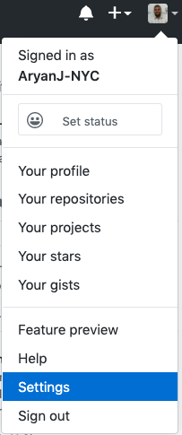
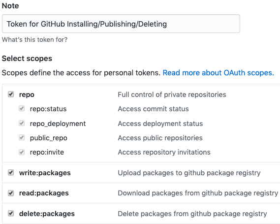

# Getting Started with the GitHub Package Registry

## What is GitHub Package Registry?

Like `npm`, the GitHub Package Registry hosts software packages both privately and publicly. These packages can be downloaded and used in your projects (like `npm`). Nothing much in your current workflow needs to change.

## [Authenticating to GitHub Packages](https://help.github.com/en/github/managing-packages-with-github-packages/configuring-npm-for-use-with-github-packages#authenticating-to-github-packages)

### Create a Personal Access Token

If you haven't already, you'll need to create a GitHub personal access token for use in the command line:

1. In the upper-right hand corner of any GitHub page, click your profile photo then click _Settings_ (which should take you to https://github.com/settings/profile):
  
2. On the left sidebar, click _Developer settings_. This should take you to https://github.com/settings/apps
3. On the left sidebar, click _Personal access tokens_. This should take you to https://github.com/settings/tokens.
4. Click the _Generate new token_ button and create a new token with the following permissions:
    * `read:packages`: allows you to download packages from GitHub Package Registry
    * `write:packages`: allows you to upload packages to the GitHub Package Registry
    * `delete:packages`: allows you to delete packages from the GitHub Package Registry

  
5. Scroll down to the bottom and click the green _Generate token_ button.
6. Click the copy to clipboard icon to copy the token to your clipboard. Make sure to store it in a safe place (perhaps LastPass or 1Password?) as this is the only time you'll be seeing this token.
7. You'll use this token in the following steps to log into the GitHub Package Registry.

Please refer to the [GitHub documentation](https://help.github.com/en/github/authenticating-to-github/creating-a-personal-access-token-for-the-command-line) for additional information.

### Authenticate to GitHub Packages

Now it's time to use the personal access token you just created. Run the following command:

- `npm login --registry=https://npm.pkg.github.com --scope=@your-github-name`
  - This command will ask your for (GitHub) username, password (enter personal access token here) and your (public) email address. Use the token generated above as the password.
- This information will then be saved at `~/.npmrc` as `//npm.pkg.github.com/:_authToken=TOKEN`. Please verify that is true.

## [Publishing to GitHub Package Registry](https://help.github.com/en/github/managing-packages-with-github-packages/configuring-npm-for-use-with-github-packages#publishing-a-package)

You're all ready to publish your first package in the GitHub Package Registry. Please note that your package will be published under `@your-github-name/package-name` (unlike what you're likely used to with the `npm` registry.

Before trying to publish, make sure you've already [authenticated](#authenticating-to-github-packages).

There are two ways to publish to the GitHub Package Registry:

### Using a Local `.npmrc`

1. Add a `.npmrc` file to the root of your project: `touch .npmrc`.
2. Inside your `.npmrc` file, write the following:

  ```bash
  # .npmrc
  registry=https://npm.pkg.github.com/your-github-name
  ```

Please note that `your-github-name` must be all lowercase! Additionally, this file must be committed to your GitHub repository.

3. Inside your `package.json` file, please modify or add the following:

  ```json
  // package.json
  {
    // ...things you have already
    "name": "@your-github-name/package-name",
    "repository": "git://github.com/your-github-name/package-name.git"
    // ... other things you have already
  }
  ```

4. Publish: `npm publish`.

### Using `publishConfig` in `package.json`

1.  Inside your `package.json` file, please modify or add the following:
  ```json
  // package.json
  {
    // ...things you have already
    "publishConfig": {
      "registry": "https://npm.pkg.github.com"
    },
    "name": "@your-github-name/package-name",
    "repository": "git://github.com/your-github-name/package-name.git",
    // ... other things you have already
  }
  ```
2.  Publish: `npm publish`.

## [Installing from the GitHub Package Registry](https://help.github.com/en/github/managing-packages-with-github-packages/configuring-npm-for-use-with-github-packages#installing-a-package)

1.  [Authenticate](#authenticating-to-github-packages)
2.  Add `.npmrc` to have:
  ```bash
  # .npmrc
  @the-github-name-of-the-org-or-person-who-created-the-package-in-lowercase:registry=https://npm.pkg.github.com
  ```
3.  Now you can successfully run `yarn` or `npm i`.

Note: This'll also work when deploying to services like Netlify, Zeit Now, etc.

And that's it! You can now install from and publish to the GitHub Package Registry. If you've any questions, take a look at the [GitHub documentation for configuring npm for use with GitHub packages](https://help.github.com/en/github/managing-packages-with-github-packages/configuring-npm-for-use-with-github-packages) or feel free to reach out to me on [Twitter](https://twitter.com/AryanJabbari).

## Follow Me
* [YouTube](https://www.youtube.com/c/thewebdevcoach)
* [Twitter](https://twitter.com/AryanJabbari)
* [Instagram](https://www.instagram.com/thewebdevcoach)
* [dev.to](https://dev.to/aryanjnyc)
