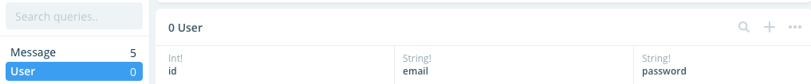
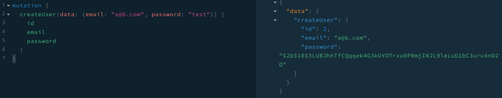

import StyledYouTube from '../../../src/components/StyledYouTube';

# User Registration with a NestJS GraphQL Server and Prisma

Phew, it’s been a while. Let’s get back to creating our NestJS server leveraging the power of GraphQL and Prisma.

By the end of this article, you’ll be able to create a GraphQL registration resolver using Prisma and NestJS. This resolver will be responsible for creating a user with an encrypted password on your Prisma backend.

First, we’ll add the User model to Prisma. Then, we’ll write a resolver for the `createUser` `mutation` that will create a user in Prisma.

I also created a YouTube video that covers this material if you'd rather watch a video.

<StyledYouTube videoId="mXM4KqTORZU" />

This article will _not_ cover login and permissions. That’ll be done in a later article.

Let’s get started!

## Disclaimer

If this is the first post you are reading from my NestJS, GraphQL and Prisma series, I suggest you go on back and read [Stand Up a Node.js Server with NestJS including TypeScript and GraphQL](https://www.thewebdevcoach.com/Stand-Up-a-Node.js-Server-with-NestJS-including-TypeScript-and-GraphQL) and [Use Prisma with a NestJS GraphQL Server](https://www.thewebdevcoach.com/Use-Prisma-with-a-NestJS-GraphQL-Server).

If reading just isn’t your thing, you can also catch up on [YouTube](https://www.youtube.com/playlist?list=PL3cz80ehFCalIYHmDQJkgdtDFesuYIYTU).

<StyledYouTube videoId="JA7d-UUGqk0" />
<StyledYouTube videoId="J1mTfisEYdw" />

## Add User Model to Prisma

By the end of this section, you should have a User model in Prisma.

To add the user model to Prisma, open your `/datamodel.prisma` file. We’ll keep the user model simple.

```graphql
type User {
  id: Int! @id
  email: String!
  password: String!
}
```

Your `/datamodel.prisma` should therefore look like this:

```graphql
type Message {
  id: Int! @id
  description: String!
}

type User {
  id: Int! @id
  email: String!
  password: String!
}
```

Now, deploy the new model to Prisma (which will add the User model to the database).

```
prisma deploy
```

Then, generate the GraphQL schema:

```
graphql get-schema
```

and lastly generate the Typescript Prisma binding:

```
graphql codegen
```

If you don’t have the packages above installed, go back to [“Defining Our Data Model and Deploying”](https://www.thewebdevcoach.com/Use-Prisma-with-a-NestJS-GraphQL-Server#defining-our-data-model-and-deploying) in the last article to learn the correct packages to download and go into more detail on the above three scripts.

Open up the Prisma console with:

```
prisma console
```

then open up the Prisma service that corresponds with this tutorial.

You should see a new User model there in the console:


Great. You can delete the Prisma generated code (now in the `/generated` directory) as it won’t be of any use to us. `git commit` your code and learn to create users with GraphQL and Prisma.

## Create a New User with Email Address and Password

With our User ready to be created in the database and our code binding, we are ready to dive into some code. First, create a NestJS user module, user service and user resolver:

```
nest g module users
nest g service users
nest g resolver users
```

The first thing we need to do is inject the Prisma service into our User service. To do that, we’ll first need to import the `PrismaModule` in the user module. Open `src/users/users.module.ts` and import the `PrismaModule`:

```typescript
// src/users/users.module.ts
import { Module } from '@nestjs/common';
import { UsersService } from './users.service';
import { PrismaModule } from 'src/prisma/prisma.module';

@Module({
  imports: [PrismaModule],
  providers: [UsersService],
})
export class UsersModule {}
```

With the `PrismaModule` imported, we can inject it into our User service. Open `src/users/users.service.ts` and inject the `PrismaModule`:

```typescript
import { Injectable } from '@nestjs/common';
import { PrismaService } from 'src/prisma/prisma.service';

@Injectable()
export class UsersService {
  constructor(private readonly prisma: PrismaService) {}
}
```

Now we’re ready to create our `createUser` service function. This function accept an `email` and `password` and:

1. Encrypt the password using `bcrypt`.
2. Send the username and password to the Prisma server (which will in turn save the data to the database).
3. Return the newly created user.

As noted in number 1, we will use `bcrypt` for our password encryption. Let’s install the package and its corresponding types:

```bash
npm install bcrypt
npm install @types/bcrypt --save-dev
# or
yarn add bcrypt
yarn add -D @types/bcrypt
```

The `createUser` function should be added to `src/users/users.service.ts` as follows:

```typescript
import { Injectable } from '@nestjs/common';
import * as bcrypt from 'bcrypt';
import { PrismaService } from 'src/prisma/prisma.service';

@Injectable()
export class UsersService {
  constructor(private readonly prisma: PrismaService) {}

  async createUser(email: string, password: string) {
    // remove any case sensitivity from our email address
    const lowerCaseEmail = email.toLowerCase();
    // hash the password
    const hashedPassword = await bcrypt.hash(password, 10);
    // sabe the user
    const user = this.prisma.mutation.createUser({
      data: {
        email: lowerCaseEmail,
        password: hashedPassword,
      },
    });
    // return the newly saved user
    return user;
  }
}
```

Perfect, now let’s use this service in our User resolver to write the `createUser` mutation. With the `createUser` function in our User /service/ doing most of the heavy lifting, the resolver is as easy as calling the service and returning the user. In `src/users/users.resolver.ts`:

```typescript
import { Resolver, Mutation, Args } from '@nestjs/graphql';
import { UsersService } from './users.service';

@Resolver('Users')
export class UsersResolver {
  constructor(private readonly users: UsersService) {}

  @Mutation()
  async createUser(
    @Args('data')
    data: {
      email: string;
      password: string;
    }
  ) {
    const user = await this.users.createUser(data.email, data.password);
    return user;
  }
}
```

## Use GraphQL Playground to Create Users

With all the code in place, we can use the GraphQL Playground to create new users. Run your development NestJS server with:

```bash
npm run start:dev
# OR
yarn start:dev
```

After it’s finished starting up, go to [http://localhost:3000/graphql](http://localhost:3000/graphql) and run the following mutation:

```graphql
mutation {
  createUser(data: { email: "test@test.com", password: "test" }) {
    id
    email
    password
  }
}
```

Your GraphQL playground should return a newly created user!


Create a few new users as we’ll need it in my next post where we cover login.

## Conclusion

With that, you now have a NestJS server with GraphQL and Prisma that allows for user registration.

If at any point you got lost in this tutorial, please refer to [this tutorial’s code on Github](https://github.com/AryanJ-NYC/nestjs-graphql-tutorial/tree/add-user). It should contain everything you need to catch up.

<StyledYouTube videoId="mXM4KqTORZU" />
