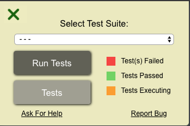

import StyledYouTube from "../../../src/components/StyledYouTube";

# freeCodeCamp Pomodoro Clock 00: create-react-app Development Environment

Congratulations on getting this far in your coding journey! You tackled HTML, CSS and JavaScript. You learned a front-end library or two and are ready to tackle the freeCodeCamp project. This is huge!

This tutorial is the first installment of a tutorial series where I cover the [freeCodeCamp Pomodoro Clock project](https://www.freecodecamp.org/learn/front-end-libraries/front-end-libraries-projects/build-a-pomodoro-clock). I’ll be following the spec pretty closely including passing 100% of the tests in the freeCodeCamp test suite.

In this tutorial _series_, we’ll:
- Stand up a new React application using [create-react-app](https://create-react-app.dev/)
- Integrate the freeCodeCamp test suite tool
- Build the freeCodeCamp Pomodoro Clock using React
- Style the freeCodeCamp Pomodoro Clock using Tailwind CSS
- Add TypeScript to your Pomodoro Clock code
- Deploy our application to Heroku
- Deploy our application to Netlify

In _this_ specific tutorial, we’ll cover the first two bullets:

- Stand up a new React application using [create-react-app](https://create-react-app.dev/)
- Integrate the freeCodeCamp test suite

Lastly, if you are more of a video learner, please follow along with the video below.

<StyledYouTube videoId="VPrmzk-1Gps" />

## Who Shouldn’t Use This Tutorial

This tutorial series is meant to get you started on the Pomodoro Clock. Funnily enough, I recommend you **DON’T** use this tutorial if you haven’t tried to tackle this project yourself. It’s best to try a project yourself and [get off that tutorial treadmill](https://www.thewebdevcoach.com/Learning-to-Code-Get-Off-the-Tutorial-Treadmill!).

Additionally, this tutorial series assumes you know the basics of HTML, CSS and JavaScript. Just the basics though. No expertise needed!

## Who Should Use This Tutorial

If you tried to get started on the Pomodoro Clock but are completely at a loss for where to start then this is for you. However, as mentioned above, if you haven’t even tried, I suggest you bookmark this tutorial and give getting started a shot by yourself.

## Stand Up a New React Project with create-react-app

We first need to [bootstrap](https://stackoverflow.com/questions/1254542/what-is-bootstrapping) a new React application. [create-react-app](https://create-react-app.dev/) is a popular tool for doing just that. It sets up an entire development environment and is super easy to use.

Open your Terminal and navigate to the folder where you have your practice projects. Assuming you already have [`node.js`](https://nodejs.org/) and `npm` (which comes with `node`) installed, run:

```bash
npx create-react-app pomodoro-clock
```

If run successfully, you’ll have a new directory in your practice projects directory called `/pomodoro-clock`. Awesome!

## Running the Create React App Template

Now that you have the basic Create React App installed on your local computer, it’s time to stand up the development server.

Before we continue, let’s talk about the development server. Realize that it’s a _development_ server which means it’s meant for developers like us. It has features that makes developers’ lives easier, such as hot reloading. With hot reloading, when we change a file, the application will reload itself so you can see the changes you made. It’s a pretty nifty tool.

To stand up your development server, go into your newly created directory with `cd pomodoro-clock` in your Terminal. From that directory, run `npm run start`. When that is finished running, visit [http://localhost:3000/](http://localhost:3000/) to confirm everything was done correctly.

Give the development server a spin! Open up your project in [your favorite text editor](https://code.visualstudio.com/) and open up `src/App.js`. Edit some text. Go back to [http://localhost:3000/](http://localhost:3000/) and witness the magic of hot reloading.

## Adding the freeCodeCamp Test Suite Tool

freeCodeCamp created a tool for running their test suite that can be easily integrated into your create-react-app template.

The freeCodeCamp test suite tool is located at [https://cdn.freecodecamp.org/testable-projects-fcc/v1/bundle.js](https://cdn.freecodecamp.org/testable-projects-fcc/v1/bundle.js) (only click if you can somehow read minified JavaScript 😝). We need _this_ JavaScript code to run in our React application. To do this, we’ll use a `<script>` tag.

In your text editor, open `public/index.html`. This is the entry point to which the React application is loaded. The specifics about that are not very important at this very moment of your coding journey so I’ll leave them out.

We’ll link to the JavaScript script above right _before_ the closing `<html>` of `public/index.html`. Your `index.html` should look as follows (comments deleted for brevity):

```html
<!-- /public/index.html -->
<!DOCTYPE html>
<html lang="en">
  <head>
    <meta charset="utf-8" />
    <link
      rel="icon"
      href="%PUBLIC_URL%/favicon.ico"
    />
    <meta
      name="viewport"
      content="width=device-width, initial-scale=1"
    />
    <meta
      name="theme-color"
      content="#000000"
    />
    <meta
      name="description"
      content="Web site created using create-react-app"
    />
    <link
      rel="apple-touch-icon"
      href="%PUBLIC_URL%/logo192.png"
    />
    <link
      rel="manifest"
      href="%PUBLIC_URL%/manifest.json"
    />
    <title>React App</title>
  </head>
  <body>
    <noscript
      >You need to enable
      JavaScript to run this
      app.</noscript
    >
    <div id="root"></div>
  </body>
  <script src="https://cdn.freecodecamp.org/testable-projects-fcc/v1/bundle.js"></script>
</html>
```

Since you have your development server running, you can go to [http://localhost:3000/](http://localhost:3000/) and see the test tool at the top-left of your application:


Click the drop-down and check out the Pomodoro Clock tests. We already passed one! Only 28 to go! We’ll do one of them next!

## Passing Your First Test

If you select “Pomodoro Clock” from the test suite dropdown (pictured above), click “Run Tests” then “Tests,” you’ll see a number of tests shown.

The first one reads: “1. I can see an element with id=“break-label” that contains a string (e.g. “Break Length”).” When I read this, I imagine _any_ HTML element with a string inside of it. Now, _since_ there’ll be a string inside of it, I’ll use the `<p>` HTML element.

I’ll delete most of `App.js` and insert the `<p>` element with a string that reads “Break”:

```javascript
// src/App.js
import React from "react";
import "./App.css";

function App() {
  return (
    <div className="App">
      <p id="break-label">Break</p>
    </div>
  );
}

export default App;
```

Go back to [http://localhost:3000](http://localhost:3000/), click “Run Tests” and “Tests” again. Congratulations! You’re passing your first test!

## 👏 You Made It!

Your development server is all set up and you’ve passed one test. You’re ready to absolutely crush it! Go through the [freeCodeCamp Pomodoro Clock project spec](https://www.freecodecamp.org/learn/front-end-libraries/front-end-libraries-projects/build-a-pomodoro-clock) and attempt the rest of the project yourself. If you get stuck, come on back to get unstuck!

If you enjoyed this tutorial, follow me at:

- [Twitter](https://twitter.com/AryanJabbari)
- [YouTube](https://www.youtube.com/c/thewebdevcoach)
- [dev.to](https://dev.to/aryanjnyc)
- [Instagram](https://www.instagram.com/thewebdevcoach/)

If at any point you got stuck in this tutorial, please review the code on [GitHub](https://github.com/AryanJ-NYC/fcc-pomodoro-clock/tree/00-create-react-app).

If you are interested in the freeCodeCamp Random Quote Machine implementation, please take a look at [my videos on YouTube](https://www.youtube.com/playlist?list=PL3cz80ehFCan4srLIp1HmhrQ0CU8Cw9XM).

## Fun Fact

When I made [my Pomodoro clock](https://aryanj-nyc.github.io/pomodoro-timer/) four years ago, freeCodeCamp recommended [Angular.js](https://angularjs.org/). You can view the code on [my GitHub](https://github.com/AryanJ-NYC/pomodoro-timer).
